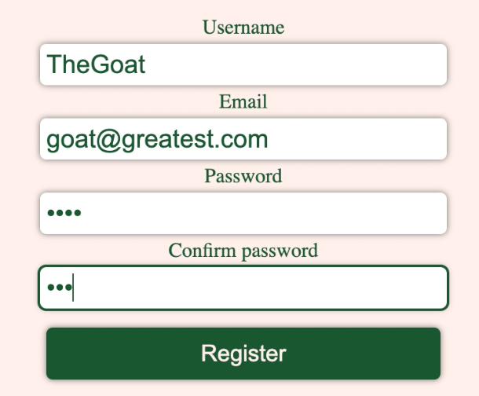
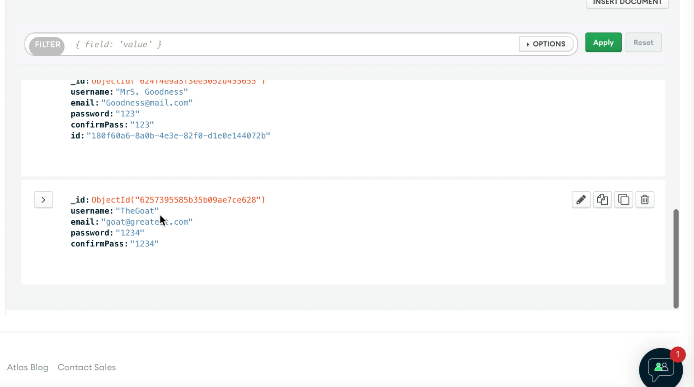

# Getting Started with The Crpto Review App

This project is a React app that allows you to search for your favorite currencies.
You will be able to see reviews of other persons, based on their experience with a coin. 
You could also leave a review of your own.

## Available Scripts

In the project directory, you can run:

cd to the Backend folder in the terminal and type:
### `npm start`
or
### `yarn start`

cd to the Frontend folder in the terminal and type:
### `npm start`
or
### `yarn start`

Runs the app in the development mode.\
Open [http://localhost:3000](http://localhost:3000) to view it in your browser.

Screen Shot: 
    
    

Passwords will be encrypted in future updates: 

